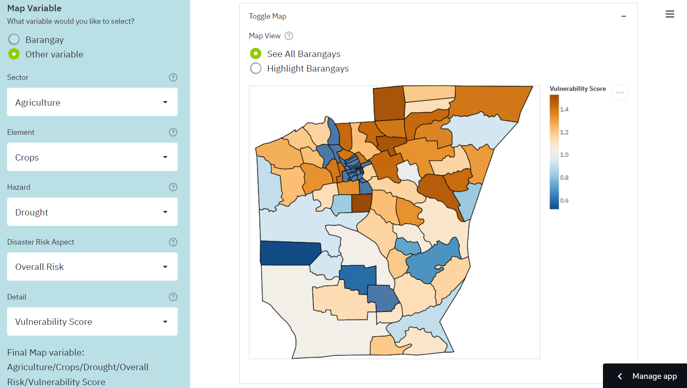
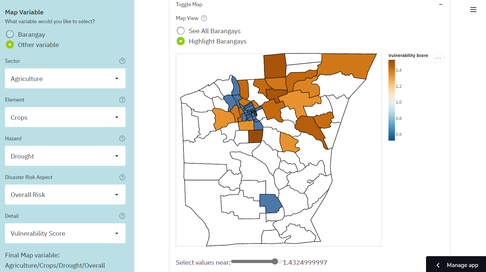

---
aliases:
- /agriHanda-2021-sparta-butuan-city-open-data-challenge/
author: Migs Germar
categories:
- python
- competition
- pandas
- altair
- streamlit
- git
date: '2021-12-17'
description: I developed a web app that won two awards in the Project SPARTA PH Open
  Data Challenge for Butuan City.
image: images/markdown-images/agriHanda/agriHanda-choropleth-map.png
layout: post
permalink: /agriHanda-2021-sparta-butuan-city-open-data-challenge/

title: 'agriHanda: an Agricultural Disaster Risk Web App'
toc: true

---

{fig-align="center"}

<center><i>The 'Map of Butuan City' feature of agriHanda.</i></center>

<br/>

In June 2021, I read that there was an upcoming local competition in data science and analytics. This was the Project SPARTA Open Data Challenge, which was organized by the Development Academy of the Philippines (DAP) and DOST-PCIEERD. The [Sparta Portal](https://sparta.dap.edu.ph/opendata/) provided open data about Butuan City, which is the "commercial, industrial and administrative center" of the Caraga region ("Butuan City", n.d.). Participants could then use this data to create cleaned datasets, datablogs, data journalism pieces, research papers, dashboards, predictive models, software applications, or visual storytelling pieces ("Approach to innovations", n.d.).

Thus, I formed a team with three of my schoolmates (Fiona Jao, Lorenzo Layug, and Yuri Dolorfino) and we entered the competition as the "Datos Puti" team. We cleaned open data about agricultural disaster risk together, then I programmed agriHanda, an app which would visualize this data.

In the end, we were awarded as "Second Placer" and "Best in Ingenious Solution." I was proud of this because this was the first data science competition that I had ever joined. Furthermore, despite being a senior high school student at the time, I was able to perform well against the other eleven competing teams, most of whom were from the college and professional levels. 

To see our certificates, use this link: [Certificates Folder](https://drive.google.com/drive/folders/1lPbGrsfzzlP8vMLa0EeajrQo3sFz2iAj?usp=sharing)

To read the DAP's article about the competition and recognition ceremony, use this link: [Winners of First-ever Hackathon and Open Data Challenge Recognized](https://sparta.dap.edu.ph/news/winners-of-first-ever-hackathon-and-open-data-challenge-recognized-6489)

In this post, I will talk about the web app, its strengths and points for improvement, and the data science skills that I honed along the way.

# The Web App

First, I will give a brief introduction to agriHanda. The "agri" part of the name refers to agriculture, whereas the "Handa" part is a Tagalog or Bisaya word for "prepared." Thus, the title encapsulates the goal of the app to help the LGU prepare for natural hazards which may pose a threat to the city's agriculture industry.

Specifically, the app is a dashboard since it focuses on creating helpful visualizations. It uses data about the vulnerability of Butuan City's crops, fisheries, and livestock viz-a-viz natural hazards such as drought, flooding, rain-induced landslide, sea level rise, and storm surge. 

The app has three main features. The "Map of Butuan City" feature shows a choropleth map. This means that the user can select a variable about agricultural disaster risk, and the colors of the barangays change based on the value of this variable. For example, it can show which general areas have a high vulnerability score of crops against flooding. The "Barangay Data Summary" feature presents tables and histograms that summarize the disaster risk scores of a chosen barangay. Lastly, the "Graphing Tool" feature allows the user to create a custom chart using one or two disaster risk variables.

For more information, you can watch our short four-minute pitch presentation about the app.: [agriHanda Video Pitch presentation](https://drive.google.com/file/d/1kw_uvdJFk2qKJkXCKcmcROv1q_6AaRE9/view?usp=sharing)

To try out the app yourself, visit this link: [bit.ly/agriHanda](https://bit.ly/agriHanda)

For more technical details about the project, visit the documentation through this link: [agriHanda - Agricultural Disaster Risk App](https://docs.google.com/document/d/e/2PACX-1vSGwaN4kZBjq2OMpkQbZPbE2GUdN6fKcGs-8ctL69KQy2CcT6hINcx91RHKince0DJPDs11_HkzLpiT/pub)

# Reflection

Now that the competition is over, it is necessary for me to reflect on agriHanda so that I can do even better next time.

First, I'd like to discuss the strengths of the project. One was that we **thoroughly cleaned and combined the data** so that it could be used in our web app and other software. Furthermore, because the variables were arranged in a hierarchy, new data can be added based on it. For example, the dataset only contains agriculture data as of now, but it could be expanded to other sectors such as infrastructure and population. It could also be expanded to include more natural hazards, such as volcanic eruption and earthquakes.

The main strength of the project, though, was that it had a **variety of visualizations**, which offered different perspectives on the data. For example, the choropleth map feature is useful for determining general areas or groups of adjacent barangays that share certain characteristics, such as high vulnerability or high adaptive capacity. The Barangay Data Summary is useful for focusing on a single barangay and determining which hazards pose the greatest threat against it. The Graphing Tool is versatile because it has various types of charts, so it can be used to answer specific questions about relationships between variables.

However, it would be difficult to use the choropleth map and the Graphing Tool if I did not provide the **Help page for the variable selection system**. This page explained the hierarchy of variables in the dataset and provided practice for how to use the variable selection system. Thus, even if this system was unusual, the app still managed to be user-friendly.

Lastly, the project also had **detailed documentation**. Apart from explaining how the web app works, it also gives instructions for how researchers can use the cleaned dataset in their own Python scripts. It also has a guide on how to start developing the web app locally, so that the LGU can revise the app instead of having me do it.

Despite all of these positive aspects, however, I know that there was still room for improvement. The most glaring issue with the project is that it **has a wide breadth but lacks depth**. The web app provides many options regarding variables and graphs. However, I did not investigate a **specific problem or research question**. Thus, I did not make any interpretations of the graphs, and instead left this task to the app users. I did not perform any **statistical tests or machine learning models**, which could have then led to concrete suggestions for how the city could prepare its agriculture against disasters. That would have had a much more direct and positive impact on Butuan City.

I must keep these things in mind the next time that I join a similar competition. Rather than a simple dashboard, I think I should try to form a research paper or a predictive model, since these have more potential to create change in a community.

# Data Science Skills

In this last part, I will discuss some of the data science skills that I honed in this project.

## pandas MultiIndex

Recall that during the data cleaning phase, I had to organize the variables into a hierarchy. Thus, I had to learn how to use the pandas MultiIndex.

For context, pandas is a Python package for manipulating tables of data, which are called DataFrames. A regular Index object is used to store the row labels or column labels of a DataFrame. In my case, each of the original data files included columns such as "Exposure", "Sensitivity", etc. Each row represented a unique barangay. Each file only gave data about a specific element and hazard (for example, fisheries and storm surge).

Below is a simplified example of what one file would look like.

| Barangay | Adaptive Capacity Score | Vulnerability Score |
|----------|-------------------------|---------------------|
| A        | 2                       | 1.2                 |
| B        | 5                       | 0.8                 |

When I combined the files, I used MultiIndex to create a hierarchy which looked like this:

| Sector               | Agriculture             |                     |                         |                     | ... |                         |                     |
|----------------------|-------------------------|---------------------|-------------------------|---------------------|-----|-------------------------|---------------------|
| Element              | Crops                   |                     |                         |                     |     | Fisheries               |                     |
| Hazard               | Drought                 |                     | Flood                   |                     |     | Drought                 |                     |
| Disaster Risk Aspect | Adaptive Capacity       | Overall Risk        | Adaptive Capacity       | Overall Risk        |     | Adaptive Capacity       | Overall Risk        |
| Detail               | Adaptive Capacity Score | Vulnerability Score | Adaptive Capacity Score | Vulnerability Score |     | Adaptive Capacity Score | Vulnerability Score |
| Barangay             |                         |                     |                         |                     |     |                         |                     |
| A                    | 2                       | 1.2                 | 5                       | 1                   |     | 4                       | 1.5                 |
| B                    | 5                       | 0.8                 | 4                       | 1.1                 |     | 1                       | 0.6                 |

The first 5 rows of the table above are part of the hierarchy of labels. The levels are Sector, Element, Hazard, Disaster Risk Aspect, and Detail. With this hierarchy, the variables can be navigated easily even if there are many of them.

For more information on MultiIndex, visit the [pandas documentation](https://pandas.pydata.org/docs/user_guide/advanced.html).

## Streamlit web app framework

Another thing that I practiced in this project was the Streamlit package. This provides a framework for building simple web apps in Python. One would first write a script which uses the Streamlit API to represent text, widgets, charts, and other visual elements.

```python
import streamlit as st

# App title
st.title('My App')

# Let the user select a variable from a drop-down list.
input_var = st.selectbox(
    'Select a variable',
    options = ['Exposure', 'Sensitivity', 'Adaptive Capacity', 'Vulnerability', 'Risk'],
)

# Make a chart using this variable.
# chart = ...

# Display the chart.
st.altair_chart(chart)
```

Then, when the app is run, the script is run from top to bottom. When the user changes something, the entire script runs again in order to update what is shown. In the case of the script above, the app would show a title, then a drop-down list, then a chart. If the user changes their selection in the drop-down list, the chart changes as well.

With this simple framework, one can quickly create an interface through which other people can interact with a dashboard or even a predictive model, so it will most likely be useful for future projects. For more information, visit the [Streamlit website](https://streamlit.io/).

## Altair package for data visualization

Another important skill I used for this project was making charts using Altair. This package allows me to create charts using a simple grammar which minimizes the amount of code needed. This usually involves the following steps:

- Make a `Chart` object and pass a DataFrame to it
- Specify a mark type, which determines the shapes used to represent data. The options include bar, boxplot, line, area, point, etc.
- Specify encodings. This means deciding which variables are used in the chart, and how so.
- Specify properties. These may include the chart title, font size, text rotation, etc.

You can experience a simplified version of these steps by using the Graphing Tool in agriHanda.

In terms of code, an example would look like this:

```python
import altair as alt

chart = (
    alt.Chart(df)
    .mark_boxplot() # Make a boxplot
    .encode(y = input_variable, type = 'quantitative') # Use the input variable on the y-axis
    .properties(title = 'Boxplot') # Set a title
    .interactive() # Make the chart interactive
)
```

Apart from the basic steps, I also learned how to use bindings, selections, and conditions. These are advanced techniques which make charts more interactive. In my case, I used these to add a slider to the Map of Butuan City feature so that only barangays near a certain value would be highlighted. This allows the user to, for example, only highlight places with high exposure to a hazard.

{fig-align="center"}

<center><i>The slider is set to only highlight barangays with the highest vulnerability score.</i></center>

<br/>

For more information about Altair, visit their [documentation](https://altair-viz.github.io/).

## Git and GitHub workflow

Another very important thing I learned was how to use basic git commands to manage my repository.

Originally, I created a blank repository, then dragged the files to GitHub and pressed "commit." I committed files in this way every time that I made a change. I later learned, however, that this was not the most efficient way to do things.

At some point, I learned that I could *clone* my repository to my laptop. This means that the files would be downloaded to a folder in my laptop, which would serve as my *workspace*. After I edit something in my workspace, I can commit the changes to my *local repository*. Thus, a snapshot of my files is saved, and I can go back to old versions if I need to. I can then push the changes to my *remote repository*, which is usually on GitHub. Thus, the latest changes to the repository are stored online.

In the case of agriHanda, since the Streamlit app is deployed from the GitHub repository, I can easily change the app just by pushing to the repository.

Admittedly, I am not familiar with using git commands in the command line. I rely on GitHub Desktop and Visual Studio Code, which provide graphical user interfaces for git commands. However, I hope to learn how to use Git Bash eventually.

The next step I can take would be to study articles like [this article](https://developer.ibm.com/tutorials/d-learn-workings-git/) by Fachat (2021), so that I can better understand how git works and how to write commands.

## Writing a README and Documentation

Lastly, the agriHanda project was my first time writing a serious README and documentation for my repository. I mainly followed the GitHub [guide for READMEs](https://docs.github.com/en/repositories/managing-your-repositorys-settings-and-features/customizing-your-repository/about-readmes). I made sure to put only the most essential information in the README, including a brief description, a link tot he documentation, the sources of the open data used in the project, the names and roles of our team members, and a statement on the terms of use of the project.

Then, in the documentation, I wrote more thoroughly about the project. It included the background of the project, purpose and objectives, main access links, explanations of the cleaned dataset and the web app, the procedure from data cleaning to app development, a local development guide for editing the project on one's local device, recommendations for how to improve the project, the credits to our team members, and a bibiography. You can read the agriHanda documentation [here](https://docs.google.com/document/d/1feKAvHEzJG2PmKtZrXvsGHOJL4c-kaTc4b_W_fHP-68/edit?usp=sharing).

---

That's all for this post. Thanks for reading!

# Bibliography

About READMEs. (2021). GitHub Docs. https://docs.github.com/en/repositories/managing-your-repositorys-settings-and-features/customizing-your-repository/about-readmes

Altair: Declarative Visualization in Python—Altair 4.2.0rc1 documentation. (2020). Altair. https://altair-viz.github.io/

Development Academy of the Philippines. (n.d.-a). Approach to innovations and innovative techniques to food sufficiency using data and technology. Sparta Portal. Retrieved December 17, 2021, from https://sparta.dap.edu.ph/opendata/lgu/butuancity/challenges/butuancity-agriculture

Development Academy of the Philippines. (n.d.-b). Butuan City. Sparta Portal. Retrieved December 17, 2021, from https://sparta.dap.edu.ph/opendata/lgu/butuancity/details

Development Academy of the Philippines. (2021, November 15). Winners of First-ever Hackathon and Open Data Challenge Recognized. Sparta Portal. https://sparta.dap.edu.ph/news/winners-first-ever-hackathon-and-open-data-challenge-recognized

Fachat, A. (2021, July 20). Learn the workings of Git, not just the commands. IBM Developer. https://developer.ibm.com/tutorials/d-learn-workings-git/

Streamlit • The fastest way to build and share data apps. (2021). Streamlit. https://streamlit.io/
The pandas development team. (2021). MultiIndex / advanced indexing—Pandas 1.3.5 documentation. Pandas. https://pandas.pydata.org/docs/user_guide/advanced.html
