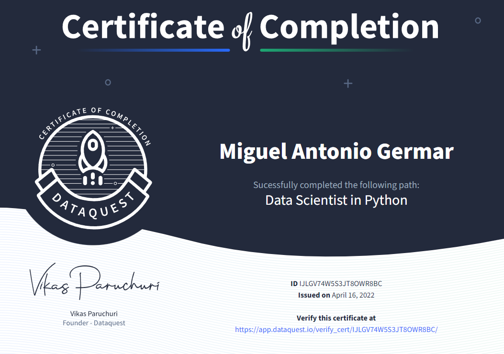

---
aliases:
- /online-course-dataquest-data-scientist-in-python/
author: Migs Germar
categories:
- python
- online-course
date: '2022-04-16'
description: Today, I finished a 325-hour online course. In this post, I show my certificate
  and outline the topics that I learned.
image: images/markdown-images/dataquest-data-scientist-python/Certificate-Dataquest-Data-Scientist-in-Python-Career-Path.png
layout: post
permalink: /online-course-dataquest-data-scientist-in-python/

title: 'Completed an Online Course: Dataquest Data Scientist in Python'
toc: false

---

{fig-align="center"}

<i>My certificate for the course. View and verify the certificate <a href="https://app.dataquest.io/view_cert/IJLGV74W5S3JT8OWR8BC">here</a>.</i>

 

Today, I completed the Data Scientist in Python (DSP) career path on the Dataquest platform. DSP is a collection of 35 courses revolving around the data science workflow in the Python programming language. It takes an estimated 325 hours to complete the path. For more information, check out the path's [webpage](https://www.dataquest.io/path/data-scientist/).

It has been a year since I started studying the DSP path in May of 2021. At the time, I had finished some courses on another platform, Sololearn, but I had not felt ready to apply the skills I had studied there. Now, after the DSP path, I am much more comfortable with working in Python. I would say that the Dataquest platform is very effective because of its unique pedagogy, which involves teaching using text and diagrams instead of videos, as well as providing many hands-on coding exercises.

Here is an outline of the topics that I learned through the DSP path:

- Python basics
    - variables, data types, loops, conditional statements, data structures, functions
    - Jupyter notebook
- Data analysis and visualization
    - pandas and NumPy packages for data manipulation
    - Matplotlib and Seaborn for data visualization
    - information design principles
- Data cleaning
    - pandas for aggregation, joining, vectorized transformations, regular expression matching, handling missing data
- Command line
    - Bash basics
    - text and CSV processing
    - virtual environments
    - Jupyter console
    - Git and GitHub for version control
- Data sources
    - SQL basics using sqlite
    - APIs and web scraping
- Statistics and probability
    - sampling, distributions, averages, variability
    - conditional probability, Bayes' theorem, Naive Bayes algorithm
    - hypothesis testing basics
- Machine learning
    - linear regression
    - logistic regression
    - K nearest neighbors
    - K-means clustering
    - decision tree
    - random forest
- Deep learning
    - artifical neural network (ANN)
    - Kaggle competition fundamentals
- Processing large datasets
    - Apache Spark basics
    - Spark DataFrames
    - Spark SQL

With these skills, I am ready to create more inquisitive and insightful data science projects.

Other than the DSP path, I also plan to study other things on Dataquest, such as the Data Engineer in Python path and the Microsoft Power BI path.

# References

Dataquest Labs, Inc. (2022). Data Scientist in Python Career Path. Dataquest. https://www.dataquest.io/path/data-scientist/