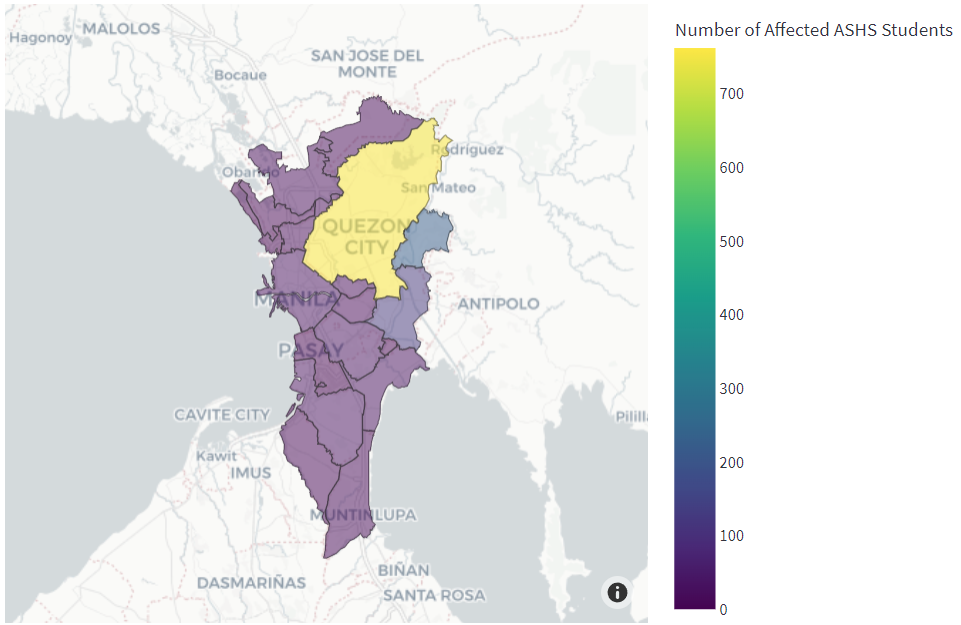

---
aliases:
- /ashs-student-mapping-project
author: Migs Germar
categories:
- python
- streamlit
- school-project
date: '2022-05-10'
description: I developed an app for identifying students in my school who are affected
  by natural hazards.
image: images/markdown-images/progvar-student-mapping-project/sample-map-metro-manila.png
layout: post
permalink: /ashs-student-mapping-project

title: 'ASHS Student Mapping Project: A Tool for Disaster Risk Reduction in the Online
  Set-up'
toc: false

---

In senior high school, I was a member of the ASHS Programming Varsity (ProgVar). Sometime in Grade 12, the ProgVar officers and I were approached by the Office of the Assistant Principal for Administration with a request to develop an app that would help identify students affected by natural hazards, especially adverse weather conditions like typhoons. I rose to the challenge and proposed the Student Mapping Project. Throughout several months, I used my free time to set up a database of student locations and develop a web app. This app can take a list of affected areas and generate a list of students who live in those areas, as well as a map showing their geographic distribution.

Shown below is an example of a map generated by the Student Mapping App. Cities in Metro Manila were selected as the affected areas. Yellow areas indicate a higher number of students and purple areas indicate a lower number.

{fig-align="center"}

Today, May 10, the app has reached its completion and it has been presented to the school principal. From here on, I'll continue to maintain the app and turn it over to the next ProgVar officers. It will have its first official run next school year.

This excerpt from the documentation summarizes the important details.

> The primary goal of the Student Mapping Project (SMP) was to identify students of the Ateneo de Manila Senior High School (ASHS) who live in areas affected by natural hazards, most commonly typhoons and earthquakes. This could help the school contact the affected students and determine whether they need assistance or monitoring.
>
> For context, the school had shifted to an online set-up in the pandemic, so ASHS students attended classes from different parts of the country. In SY 2021-2022, out of a total of 1879 students, only 40.5% lived in Quezon City, where the school is based, whereas 31.1% lived elsewhere in Metro Manila, and 28.4% lived elsewhere in the Philippines. Therefore, there was a need for wider monitoring of hazards and automated identification of affected students.
> 
> Several parties collaborated in the creation of this project. The main project proponent, Miguel Antonio H. Germar, was a member of the ASHS Programming Varsity (ProgVar). He developed the Student Mapping App (SMA) with the following objectives in mind: (1) to create a database where students’ locations are stored in a standardized format; (2) to develop a feature where the user may input the list of locations affected by a hazard; and (3) to develop a feature that automatically identifies the affected students and provides relevant statistics, maps, and tables.
> 
> Another involved party was Kanlaon, the student committee in charge of projects related to the environment and disaster risk reduction (DRR). The role of Kanlaon in the project was to use the SMA to identify students affected by hazards currently occurring in the country. They would then write reports to help the school conduct constituency checks, which involve contacting affected students to determine whether they require assistance.
> 
> Also involved in the project were the following members of the school administration: the Office of the Assistant Principal for Administration (OAPAdmin), the Student Services Coordinator (SSC), and the Information Technology (IT) department. They were regularly consulted in order to ensure that proper procedures were followed, especially with regard to the students’ data privacy.

To view the full documentation, use this link: [Documentation for ASHS Student Mapping Project](https://docs.google.com/document/d/e/2PACX-1vTcOR17OofeZ1UoryPjDDBaTGVicMGAdSNP6HqeGMNkN37PoVrCOOQsXwzflGNPLaZojo6-MkIDUNEe/pub)

This project used the Global Administrative Areas (GADM) database, which is free for non-commercial use.

# References

University of Berkeley, Museum of Vertebrate Zoology and the International Rice Research Institute. (2018, April). Global Administrative Areas (GADM) Version 3.4. GADM. https://gadm.org