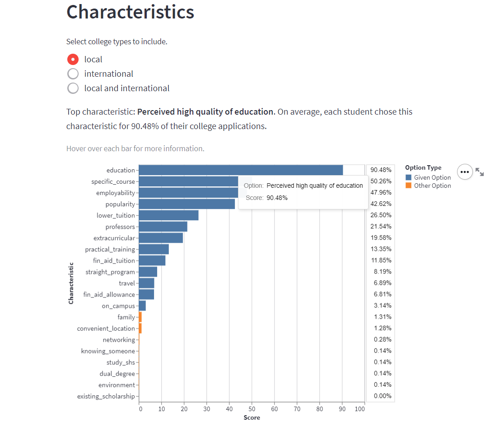

---
aliases:
- /ashs-college-applications-dashboard
author: Migs Germar
categories:
- python
- streamlit
- school-project
date: '2022-07-05'
description: I developed a dashboard visualizing my senior high school's college application
  choices and the factors influencing them.
image: images/markdown-images/dac-college-apps-dashboard/overview-page-characteristics-graph.png
layout: post
permalink: /ashs-college-applications-dashboard

title: ASHS College Applications Dashboard
toc: false

---

I worked with some members of the Data Analytics Committee (DAC), one of my extracurriculars in senior high school, to conduct a study on our schoolmates' college applications and the factors that went into them. We disseminated a survey where students could input their college choices. For each college, they would tell us the college location, the interests (like STEM-oriented, ABM-oriented, etc.) related to their chosen courses, and the characteristics of the college that most influenced their choice to apply. Then, I cleaned the data and visualized it in the College Applications Dashboard.

The dashboard can be viewed here: [ASHS College Apps Dashboard](https://share.streamlit.io/miguelahg/college-applications-dashboard/app_main.py)

Shown below is an example of a graph in the dashboard. First, the user may select whether they want to see data for local college applications, international ones, or both. The graph updates accordingly. The y-axis shows labels for college characteristics, such as: perceived high quality of education, having a specific course, higher employability of graduates, perceived popularity, low tuition compared to my other choices, etc. The x-axis shows the Score from 0% to 100%, which is calculated as the average proportion of a student's college applications where they said that a particular characteristic influenced their choice. If you hover over a bar, a tooltip shows up with the full title of the characteristic and the score. Furthermore, the headline above the graph is there to highlight the most popular characteristic and help the viewer know how to interpret the graph.

{fig-align="center"}

This project used the Global Administrative Areas (GADM) database, which is free for non-commercial use.

# References

University of Berkeley, Museum of Vertebrate Zoology and the International Rice Research Institute. (2018, April). Global Administrative Areas (GADM) Version 3.4. GADM. https://gadm.org