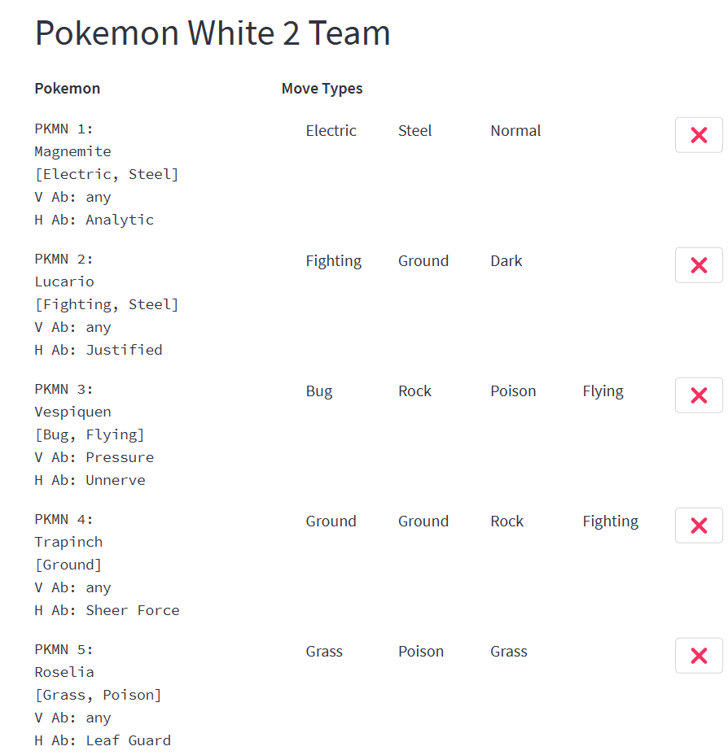
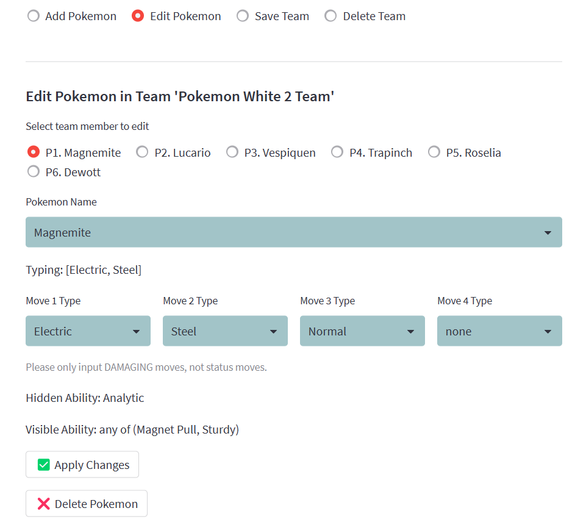
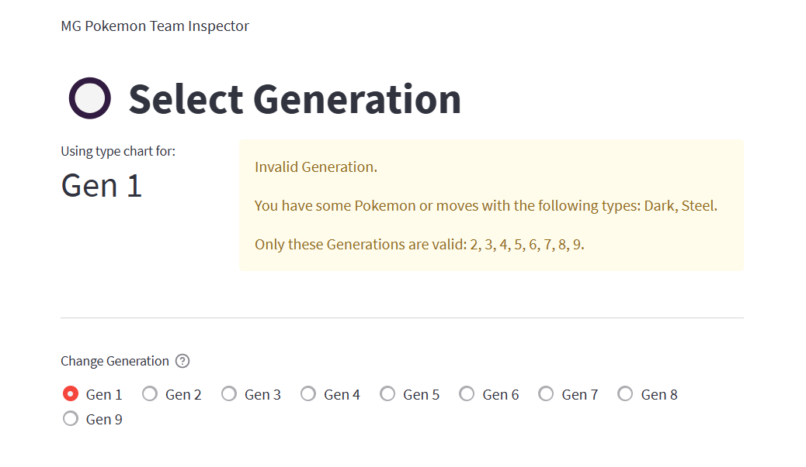
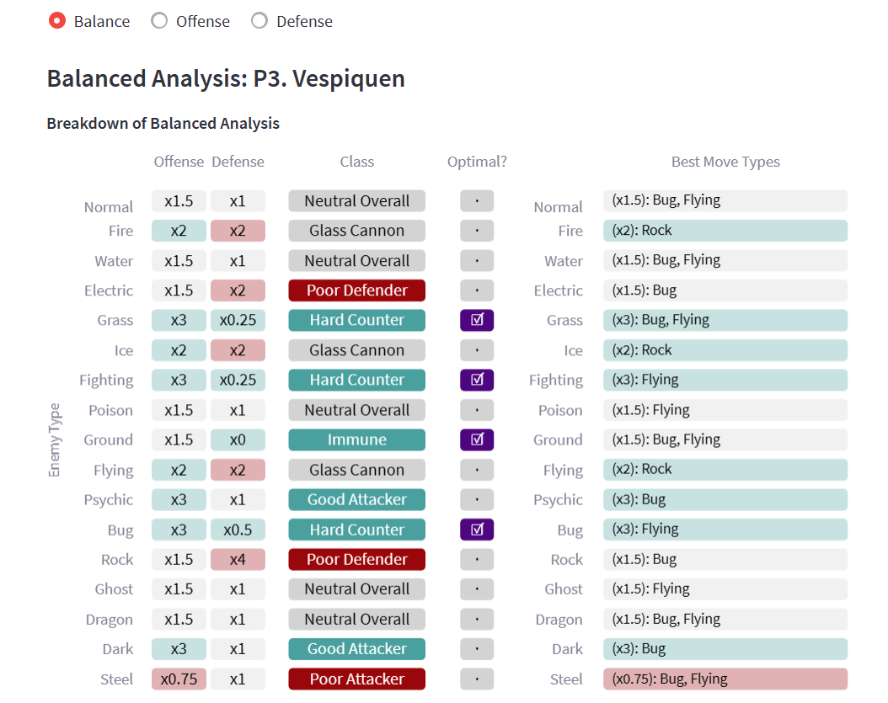
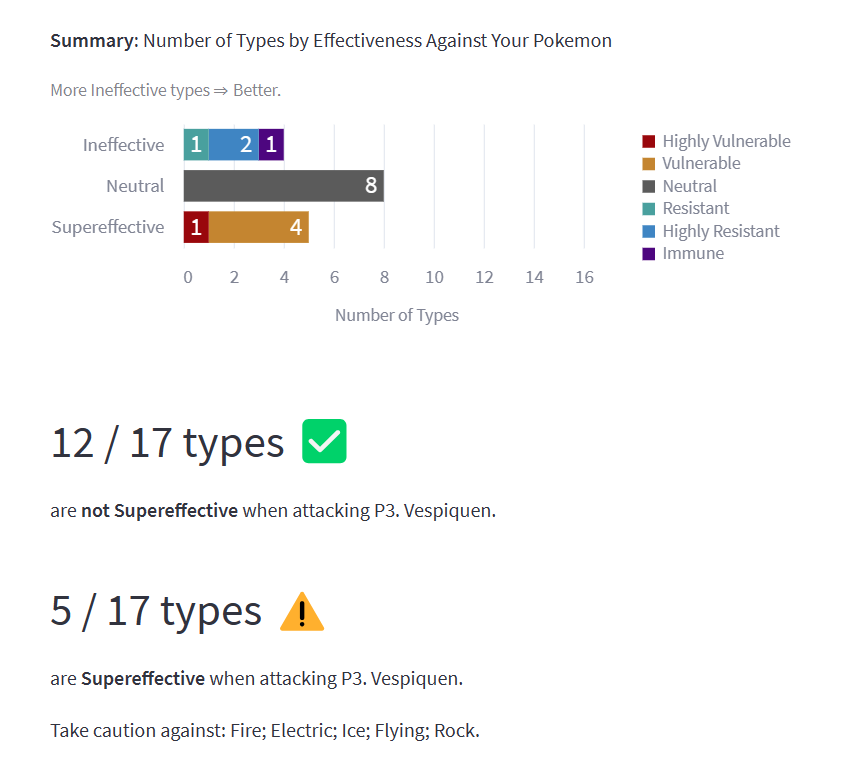
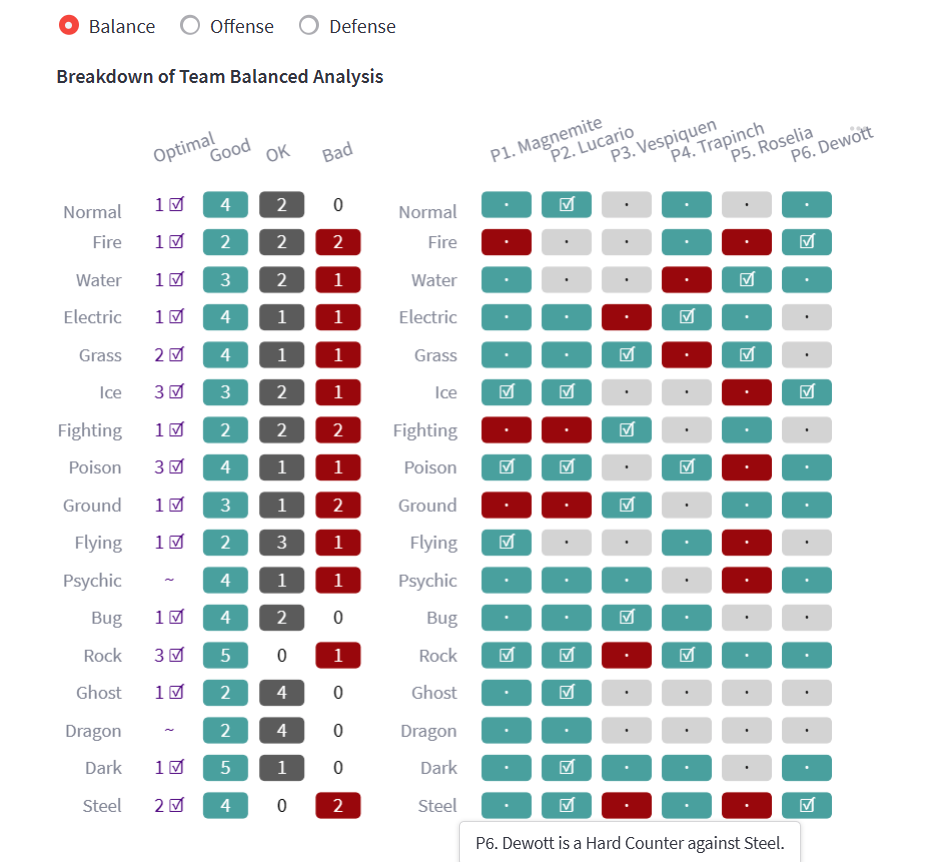
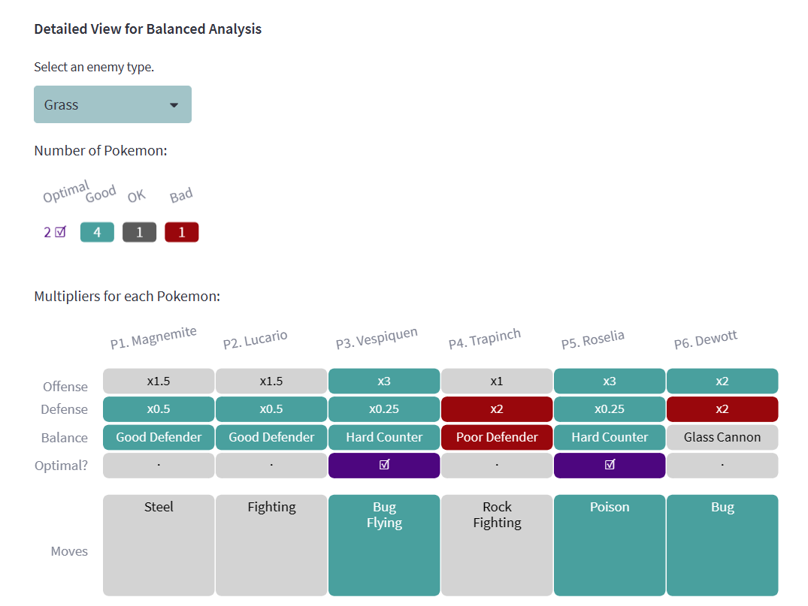

I've been dissatisfied for a long time with websites that analyze Pokemon based on type effectiveness because they tend to have one or more of these drawbacks:

- They don't consider both offense and defense simultaneously.
- They don't let you input custom Pokemon with any type combination, move types, and two Abilities of your choice.
- They make you input the Ability of each Pokemon manually. Some people may not realize that their Pokemon has a Hidden Ability that affects its type matchups.
- They only use the type effectiveness rules for the latest generation of Pokemon games, making their insights inaccurate to older games.

**With this in mind, I made an improved web app, which you can access here:**

[https://mg-pokemon-team-inspector.streamlit.app/](https://mg-pokemon-team-inspector.streamlit.app/)

First, you would input your Pokemon team into the app and it would be displayed like this:

{fig-align="center" width=500}

You have the following options in managing your teams: add Pokemon, edit Pokemon, save the team so you can load it into the app later, or delete the team.

You can choose a Pokemon's species from the complete Pokedex and input the types of damaging moves your Pokemon has. In some cases, you will be prompted to indicate which Ability your Pokemon has, since this affects its type matchups. **All of this information will be used later in the analysis.**

{fig-align="center" width=500}

Different Pokemon generations have different rules about which types are effective against others and which Abilities affect a Pokemon's type defenses.

**The app takes care of all of that automatically.** All you have to do is select the generation of the game you're playing in the Select Generation page.

If you have some Pokemon that are incompatible with the selected generation, the app tells you the problem so you can fix it, like in this picture:

{fig-align="center" width=700}

Next, you can look at the Analyze Individual Pokemon page. There are three aspects to choose from: Balance, Offense, and Defense. **The Balance aspect considers both the offense and defense of the Pokemon against each possible enemy type.** It displays labels describing the Pokemon's usefulness against each type.

For example, the picture below shows an analysis of the Pokemon Vespiquen. **This Pokemon is labeled as a "Hard Counter" against Grass type Pokemon because it both deals supereffective damage, and takes not-very-effective damage, when fighting Grass types.**

Plus, the rightmost column of the table tells you which of your Pokemon's move types deal the most damage against a particular type of enemy.

{fig-align="center" width=600}

The Offense and Defense aspects have similar tables, but they also have bar charts and other messages to the user. These summarize the information and note important things to look out for.

Here's the summary for the Defense analysis of one Pokemon:

{fig-align="center" width=600}

Finally, the most useful feature of the app is its ability to analyze an entire team of Pokemon, showing you how many of your Pokemon are bad, OK, useful, and optimal against each type of enemy. This can help you think of ways to modify your team to cover a wider range of situations.

{fig-align="center" width=600}

In this case, I hovered my mouse over the bottom right cell, so that's why a message popped up and said, "Dewott is a Hard Counter against Steel." I can hover over any cell in the table to get an explanation like this to help me interpret it.

**In the leftmost column, I can immediately see that I have at least one optimal Pokemon against most types of enemies, except for Psychic and Dragon.** I have some Pokemon that are useful against these types, but not optimal. I may want to adjust my team to fix this.

Also, if I encounter an enemy of a particular type, like Fighting, I can look at the row in the table with the same name. It shows me that I should avoid using Magnemite and Lucario against Fighting types, but Roselia is useful and Vespiquen is optimal.

Under that chart, there is also a "Detailed View" that lets you choose one enemy type and see the exact numbers behind the insights.

{fig-align="center" width=600}

This project used the Streamlit framework for web app development, the pandas package for data manipulation, and the Altair package for data visualization.

Thanks for reading!

# Credits

The app was developed by Miguel Antonio H. Germar.

I used the Pokedex dataset `Pokedex_Ver_SV2.csv`, which was downloaded from the following webpage; it is provided publicly without any explicit license. I used the data on Pokemon species names, single and dual typings, Abilities, and Hidden Abilities from this dataset.

`Takamasa Kato. “Pokemon All Status Data (Gen1 to 9).” Kaggle, April 14, 2023. https://www.kaggle.com/datasets/takamasakato/pokemon-all-status-data.`

I created datasets with type effectiveness multipliers (for example, 2 is the multiplier of Fire attacks against Grass Pokemon) by manually copying the numbers in the type chart in the following reference:

`Pokémon Database. “Pokémon Type Chart: Strengths and Weaknesses.” Pokémon Database, 2023. https://pokemondb.net/type.`

I obtained the list of Pokemon Abilities that affect type effectiveness (e.g., Dry Skin, Earth Eater, etc.) from the Pokemon Calculator website:

`Fennel, S. (2023). Pokémon Type Calculator Defense Page. Pokémon Type Calculator. https://www.pkmn.help/defense`

Then, I used [Bulbapedia](https://bulbapedia.bulbagarden.net/wiki/Main_Page) to learn how exactly those Abilities affect type effectiveness multipliers.