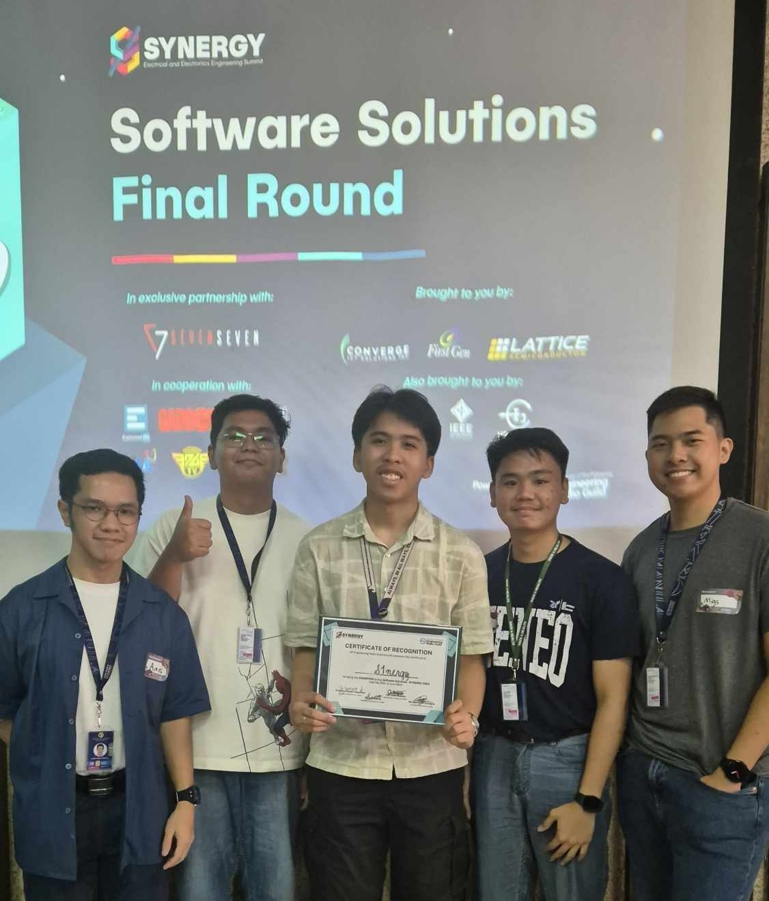
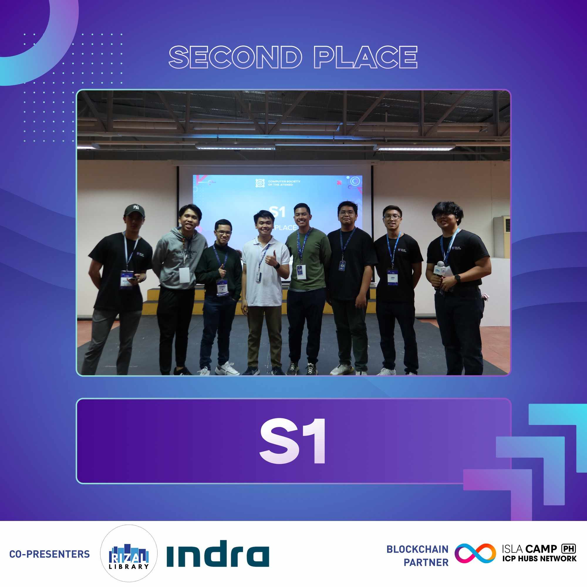

---
aliases:
- /blue-hacks-synergy-2024/
author: Migs Germar
categories:
- python
- competition
- pandas
- seaborn
- streamlit
- git
date: '2024-07-22'
description: Our team won 1st and 2nd place in two coding competitions, Synergy Software Solutions 2024 and Blue Hacks 2024, respectively. We had developed a comprehensive personal carbon footprint calculator, as well as a mental health platform for students and guidance counselors.
image: images/markdown-images/blue-hacks-synergy-2024/synergy-2024-group-photo-01.jpg
layout: post
permalink: /blue-hacks-synergy-2024
title: '📌 1st and 2nd place in Two Coding Competitions'
toc: false
sticky_rank: 4

---

{fig-align="center" width=400}

<i>Our team, S1nergy, at Synergy Software Solutions 2024. Left to right: Aames Juriel Morales, Armand Sotelo, Franz Andrei Layug, Val Allen Eltagonde, and Miguel Antonio Germar (me).</i>

 

# Synergy 2024

On June 26, 2024, our team presented the eSUKAT project at Synergy Software Solutions 2024 (hosted in the UP Diliman EEEI) and won first place. We had become a team since we are all incoming 3rd year BS Applied Mathematics - Master in Data Science students at Ateneo. In late May, we worked on a business proposal based on the prompt, **"Design a simple app that allows users to calculate their carbon footprint based on their daily activities, such as transportation, energy use, and food intake."** This led us to develop an app with the following features implemented:

- eSukat: Emission Trackers
  - **Food consumption tracker.** You can record your food consumption in the app by selecting food and drink items and indicating how much of it they consumed (in grams, mL, or money spent in Php). You can view and edit your food consumption from the past 14 days. The app calculates the equivalent carbon emissions caused by the production of your food in kilograms of CO$_2$ equivalents. For these calculations, we used emissions factors from [Climatiq](https://www.climatiq.io/data), a database compiling emission factors calculated by credible institutions.
  - **Electricity tracker.** If you upload a picture of your Meralco bill, the app will read the electricity consumption data from the past two years. You can keep uploading your Meralco bill every month to update the tracker, and you can also type your electricity consumption manually if your bill was not read correctly. Then, the app estimates the corresponding carbon emissions based on the energy mix of nonrenewable and renewable energy types in your electric grid (Luzon, Visayas, or Mindanao).
  - **Transportation tracker**. After you input your starting point, destination, and mode of transport, the app calculates the distance travelled and the corresponding carbon emissions. If you use multiple modes of transport throughout the day, then you can simply input different trips separately to get an accurate idea of your transport emissions.
- eSulong: Data Dashboard
  - **Personal dashboard**. You can view your carbon emissions from the past year, compare emissions from the past 2 years, or view an analysis of all of the years since you started using the app. The dashboard displays simple and relevant information, such as: a pie chart showing how much of your emissions came from food, electricity, or transport; bar graphs showing how your emissions changed over time; and indicators of how much your emissions have increased or decreased compared to the same month last year, and the equivalent number of native Philippine trees that would be needed to offset those emissions.

Our [business proposal](https://drive.google.com/file/d/1tOS1G9jkAGhFJ5-CFsboQNaJEYuFE9gv/view?usp=drive_link) describes the other features we had planned for the app and lists our references for calculating carbon emissions. Also, here is the [Synergy Facebook page](https://www.facebook.com/SynergyPH) and a [post](https://www.facebook.com/share/p/SDzFbBYGbYDbrpf7/) announcing the winners.

Our original code repository for the eSUKAT project is private, but a forked version can be publicly viewed here: [MiguelAHG/synergy-eSUKAT-fork4](https://github.com/MiguelAHG/synergy-eSUKAT-fork4).

# Blue Hacks 2024

{fig-align="center" width=400}

<i>Our team, S1, at Blue Hacks 2024. I'm the one in a green sweater.</i>
 

 

Earlier this year, I had also joined Blue Hacks 2024 with the same team. This was an overnight hackathon hosted in Ateneo; we had 24 hours to make **an app that helps people with their mental health**. We got 2nd place for Bughaw, an online mental health platform meant to be set up within a school community. It has the following features:

- Student Portal
  - **Schedule appointment**. You can quickly schedule an appointment with a guidance counselor based on their available time slots. Requirements like submitting student information and choosing a schedule in a calendar are all done on one page in the app. Our rationale was that the current way of scheduling a counseling appointment in Ateneo is rather confusing.
  - **Chat with guidance counselor**. This is a private chat between the student and their assigned counselor, to ease communication regarding scheduling and counseling matters without having to use personal accounts on messaging platforms.
  - **Support group chat**. If the school decides to group students into online support groups, this feature of the app lets them communicate anonymously, and it is set up so that each group has a guidance counselor to moderate the chat.
  - **Brief mental health surveys**. There is a daily mood tracker, as well as more specific surveys on mental health disorder symptoms which the app can ask students to do once per few weeks or a month.
  - **Mental health resources.** One feature is a regularly updated feed of mental health-related articles and research from different websites, implemented via RSS. There is also a feature that lets you select which negative emotion you want to reduce and gives tips on how to do that.
- Guidance Counselor Portal
  - This lists the counselor's scheduled appointments, enables the counselor to chat with their assigned students and chat in the support group chat they are moderating, and view anonymized aggregated results of the brief mental health surveys.

Here is the [Blue Hacks page](https://www.facebook.com/BlueHacksAdMU) and a [post](https://www.facebook.com/share/p/TZuFsutfEhH3RhfN/) announcing the winners.

Our official code repository for the Bughaw project is not publicly available because it is in the account of the event organizers. A mirror of the repository, which we set up for test-deploying the app online, is here: [MiguelAHG/sigma-one-test](https://github.com/MiguelAHG/sigma-one-test).